# **Sistemas de domótica de Roni Hernández**

Mi proyecto consiste en un pequeño sistema de domótica el cual es administrado por una interfaz gráfica de escritorio la cual es capaz de hacer lo siguiente: 

*  Controlar el prendido y el apagado de un foco RGB, asi como el color al que este prende entre una variedad de 7 posibles colores (blanco, verde,amarillo, rojo, magenta, azul, cian)
*  Controlar el prendido y el apagado de un ventilador 
*  Avisar al usuario cuando se detecte un  incendio
*  Permitir la programación de alarmas.
*  Ofrecer un sistema de administración de deberes.

## **Explicación del sofware del proyecto** 

A continuación, se adjuntará una imagen del sistema de domótica y una breve explicación de cada apartado de ella:

<!--style="margin-left:auto;margin-right:auto;width:100%;"-->

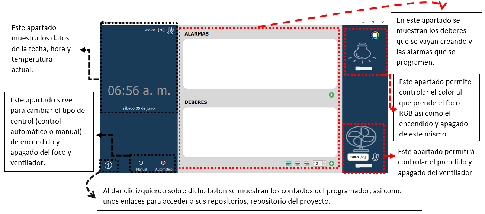

<!--   -->

Explicado lo anterior ahora proseguiré a explicar de una forma más detallada cada función del sistema de domótica:

## **A. Sistema de deberes**

La GUI permite  agregar deberes con la finalidad de que cada que vez que se termine un deber agregado, se  pueda eliminarlo de la lista de deberes, y sentir esa satisfacción personal de eliminar los deberes cada vez que se van cumpliendo.

### 1. ¿Como crear un deber?
* Dar clic izquierdo sobre el botón redondo de color verde con una cruz blanca dentro el cual se encuentra debajo de la esquina inferior derecha del rectangulo blanco que se encuentra debajo de la leyenda 'DEBERES'
* Posteriormente se aparecera una rectangulo blanco, ahi debera escribirse el deber.
* Si se desea crear otro deber se deberan repetir los pasos antes mencionados.

En el siguiente ejemplo se crearan 3 deberes:
  * correr en la mañana
  * hacer tarea
  * estudiar en la noche

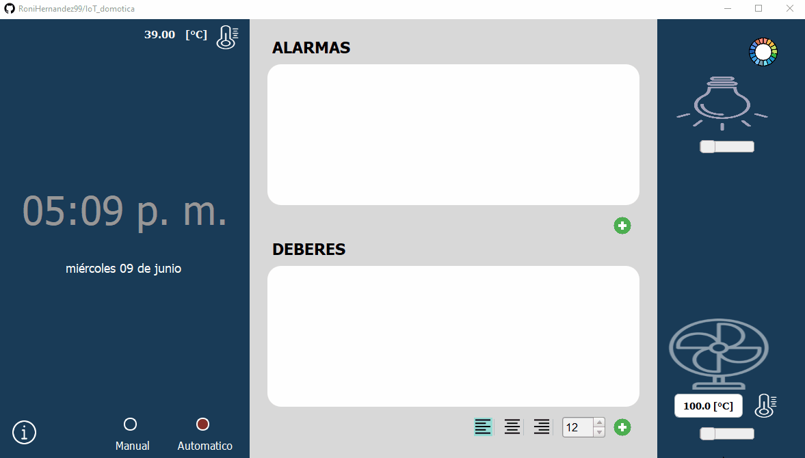

<!---->

### 2. ¿Como cambiar el tamaño y la posición del texto de los deberes?
* Si se desea cambiar el tamaño de la letra de los deberes se deberá modificar el valor numérico del rectángulo que se encuentra a lado izquierdo del boton que sirve para agregar deberes:

<!---->

* Si se desea cambiar la posición del texto de los deberes, se deberá dar clic sobre el icono respectivo de alineación:

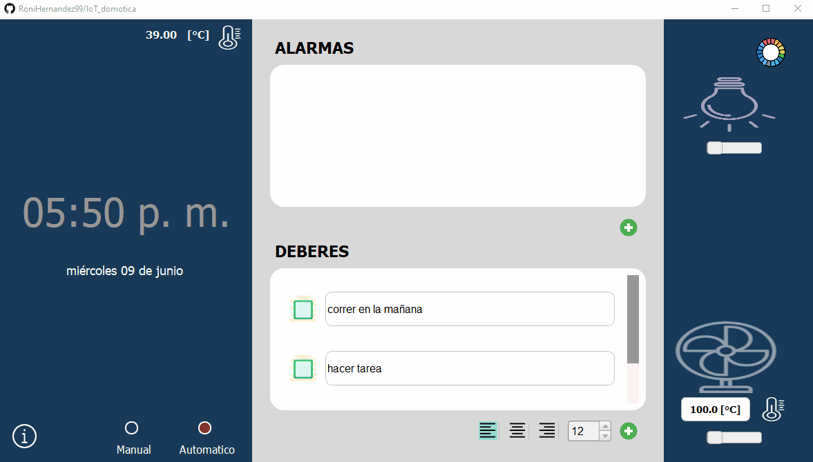

<!---->

### 3. ¿Que pasa cuando los deberes han sido cumplidos?
* Para eliminar un deber  ya sea por que se cumplio o por que hubo una equivocacion al crearlo se debera hacer lo siguiente:
  * Dar clic izquierdo sobre el cuadrado que se encuentra al lado izquierdo del deber que se desea eliminar
  * Al hacer el paso anterior  se  desplegara un cuadro de dialogo, el cual preguntara si efectivamente se desea eliminar el deber, se debera dar clic izquierdo sobre la opccion 'si'.

En el siguiente ejemplo se eliminaran 2 deberes:
  * correr en la mañana
  * hacer tarea

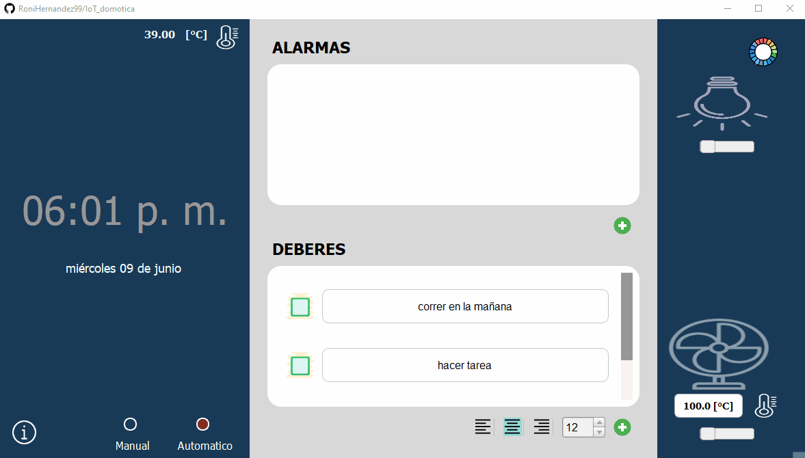

<!---->

## **B. Sistema de administración de alarmas**
 
El sistema de alarmas permite  agendar  alarmas tal y como lo hace un teléfono celular, es decir permitirá:

•	Asignar un nombre a la alarma

•	Escoger la canción que tocará la alarma al ejecutarse, entre una lista de canciones que ofrecerá el programa de forma default o canciones que el usuario puede importar desde su administrador de archivos.

•	Escoger la hora y el día o los días en las cuales la alarma debe sonar.

•	Crear como máximo un numero de 50 alarmas.

•	Editar alarmas que ya fueron creadas.

•	Eliminar alarmas que ya fueron creadas.

•	Desactivar o activar una o varias alarmas.

A continuacion se proseguira a explicar de forma mas detallada 

### **1) ¿Como crear una alarma?**
* Dar clic izquierdo sobre el botón redondo de color verde con una cruz blanca dentro, el boton se encuentra debajo de la esquina inferior derecha del rectangulo blanco que se encuentra debajo de la leyenda 'ALARMAS'

* Posteriormente se aparecera una ventana en la se deben ingresar los datos de la alarma que se desea crear

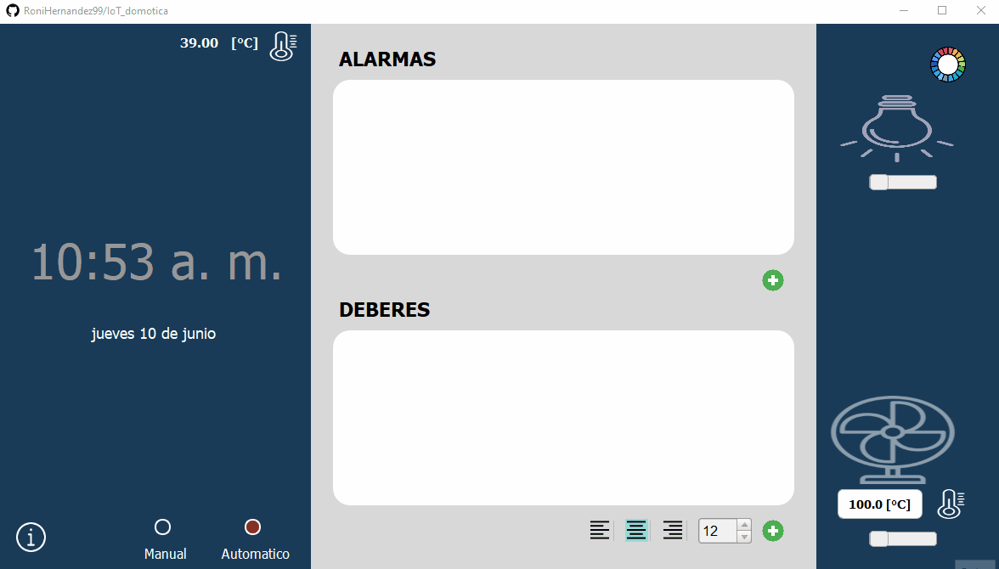

* Antes de dar un ejemplo de como crear una alarma primero  se proseguira a explicar cada aparatado de la ventana que se abrio al hacer el paso anterior.

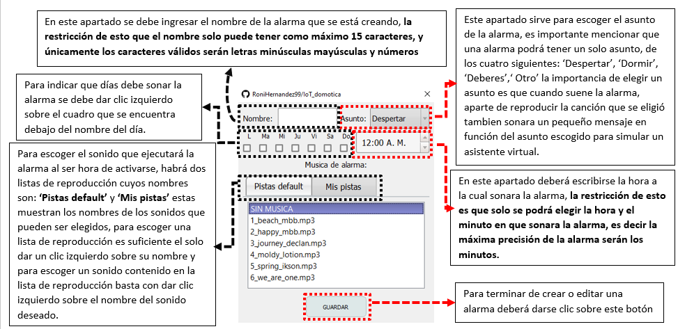

* Una vez explicada la ventana anterior, se proseguira a dar un ejemplo de como crear una alarma con las siguientes caracteristicas:

  * Nombre de la alarma: 'horaEscuela' 

  * Dia en los cuales sonar: lunes,martes,miércoles,jueves y viernes
  
  * Hora a la que sonara: 4:45 am  
  
  * Asunto: Despertar 
  
  * Cancion: Sera una de las que traer por default el programa

Una vez hecho lo anterior se podrá observar que apareceran los datos de la alarma creada dentro del   rectangulo blanco que se encuentra debajo de la leyenda 'ALARMAS', y eso ocurre por que todas las alarmas que se creen se mostraran ahi para que puedan ser facilmente editadas visualizadas o eliminadas.
 

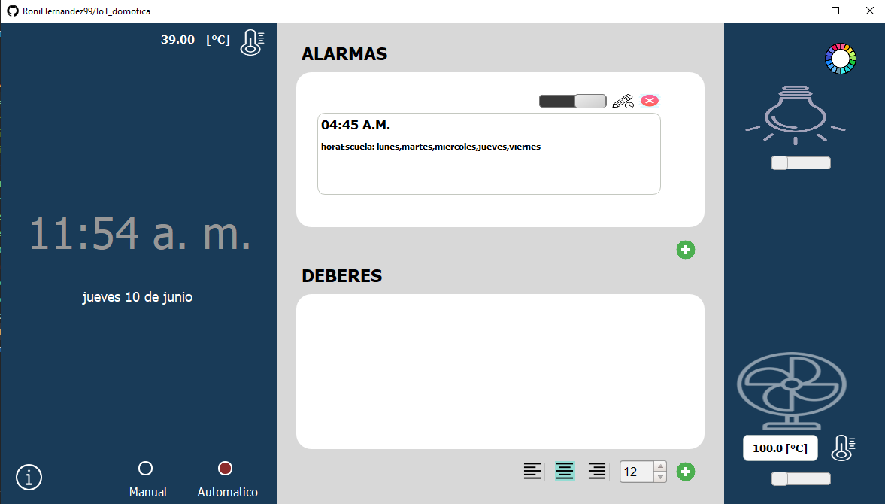

A continuacion se crearan 2 alarmas mas para que se pueda apreciar de mejor manera lo anterior mencionado:

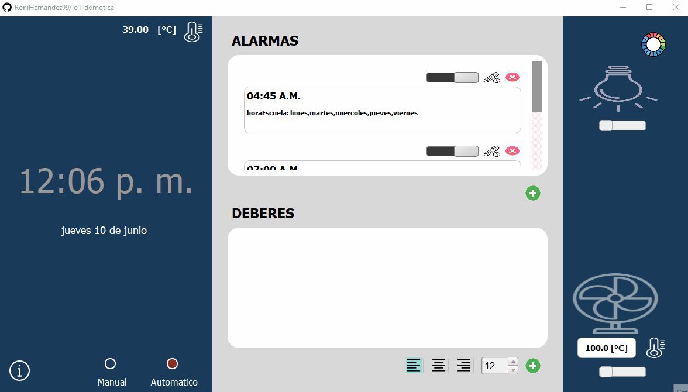

Es importante resaltar que los datos claves que se muestran de cada alarma creada, son los siguientes:

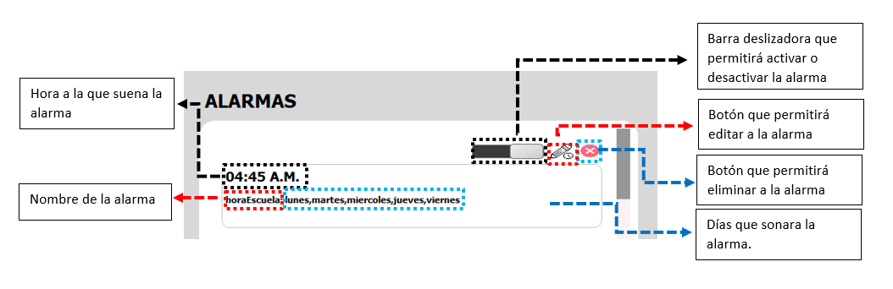

### **2) ¿Como editar una alarma?**

Si se deseara editar una alarma, se debe dar clic izquierdo sobre el icono del lápiz que se encuentra en la esquina superior derecha de la alarma que se desea editar.

En el siguiente ejemplo se desea editar la alarma cuyo nombre es: **'irCorrer'** la cual suena los dias: **'sabado y domingo'** a las: **'6:45 am'**, los nuevos cambios que se desean hacer son los siguientes:
  * Que ahora suene a las: **'7:00 am'** los dias: **'sabado,domingo y lunes'** 

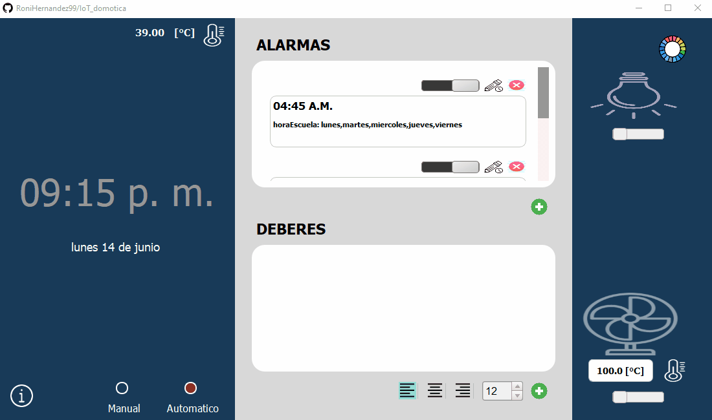

### **3) ¿Como eliminar una alarma?**

Si se desea eliminar una alarma, se deberá dar clic izquierdo sobre el icono del tache que se encuentra en la esquina superior derecha de la alarma que se desea eliminar.

En el siguiente ejemplo se desea  eliminar la alarma  **‘horaEscuela’**:

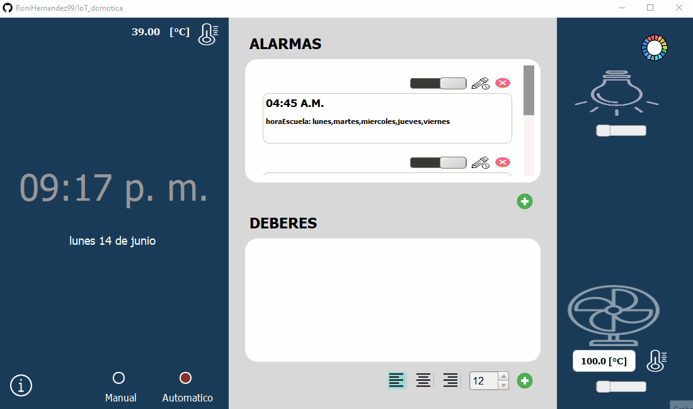

### **4) ¿Como desactivar y activar una alarma?**

Si se deseara desactivar una alarma para que no suene, se deberá deslizar la barra deslizadora que se encuentra en su esquina superior derecha.

En la siguiente imagen se activa y desactiva la alarma cuyo nombre es: **'irCorrer'**

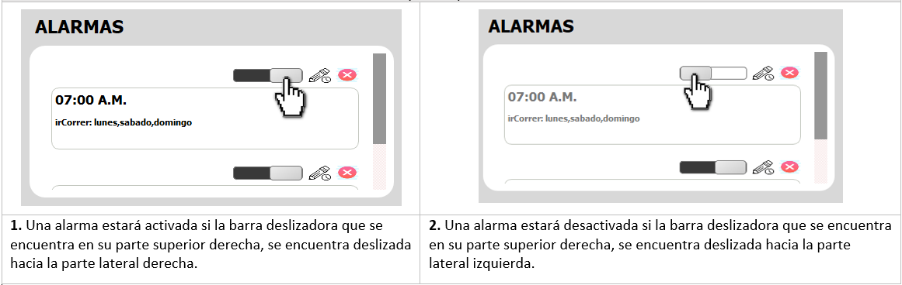

### **5) ¿Que pasa cuando es la hora de sonar de una alarma?**

Se mostrará un cuadro emergente con únicamente dos datos de la alarma que está sonando: la hora a la que debe sonar y el nombre de la alarma

En el siguiente ejemplo se puede apreciar que hay una   eliminar la alarma  **‘horaEscuela’**:

### **6) ¿Como establecer como canción de alarma una canción de mi eleccion?**

El programa permite importar canciones en  la ventana que se abre cuando se esta creando una alarma o editando un alarma.Una vez abierta dicha ventana, para importar una cancion se deberan seguir los siguientes pasos:

* Primero deberá escogerse la lista de reproducción ‘Mis pistas’ dando clic izquierdo sobre el botón respectivo.

* Si no se ha agregado ninguna canción se vera una  lista de reproducción vacía pero en caso contrario 
se veran los nombres de las canciones ya importadas.

* Para agregar una canción se deberá dar clic sobre el botón de forma de carpeta, el cual al hacer clic sobre el, la GUI abrira el explorador de archivos el cual permite elegir la canción que se desea agregar desde la ubicación en donde se encuentre.

* Una vez escogida la canción se aparecera en la lista de reproducción lista para ser seleccionada.

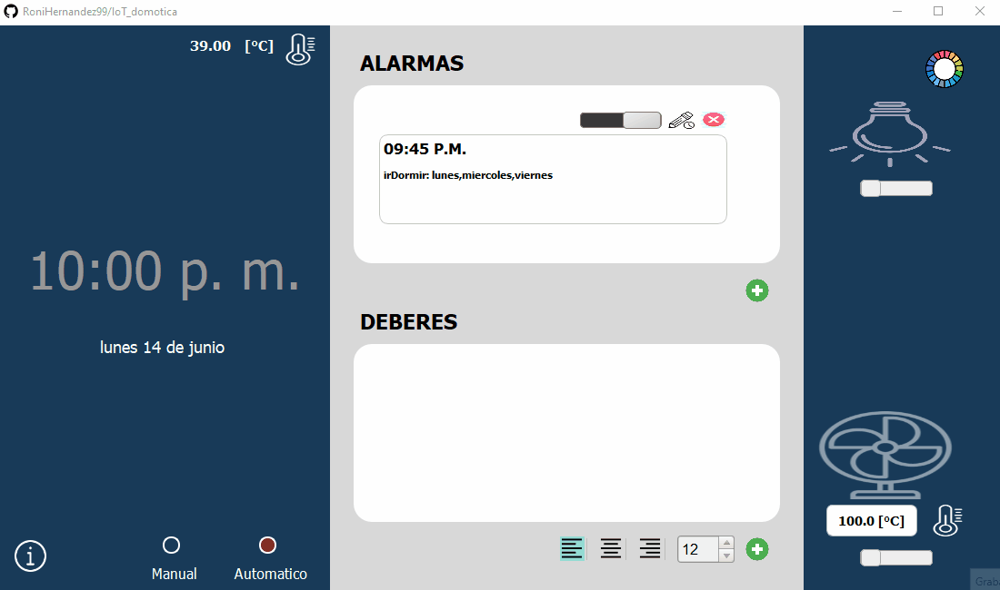

## **C. Sistema de control**

### **1) Mostrando la hora, el dia y la temperatura**

El sistema muestra  al usuario:
•	La fecha en la cual se encuentra (nombre del día, numero de día, nombre del mes y año)

•	La hora en la cual se encuentra (hora, minuto, AM/PM)

•	La temperatura actual a la que se encuentra. Es importante mencionar que la temperatura que muestra el programa  se actualiza  cada vez que el sistema detecta una variación de temperatura de +- 0.3 [°C]

### **2) Prendido manual y automático de los objetos: led RGB, y ventilador.**

El programa ofrece dos modalidades para controlar el prendido y apagado de los objetos(ventilador y led RGB) las cuales son las siguientes:

  * Control automatico
  * Control manual 

#### **2.1) ¿Cómo funciona exactamente cada modalidad?**  

<table>
    <thead>
        <tr>
          <th >Dispositivo</th>
          <th colspan=2>Tipo de encendido y apagado</th>
        </tr>
        <tr >
            <th>  </th>
            <th > Automatico </th>
            <th> Manual</th>
        </tr>
    </thead>
    <tbody>
        <tr>
            <td> LED RGB </td>
            <td >Si se detecta un aplauso o un sonido similar, se prendera el LED RGB si se encontraba apagado, o se apagará si se encontraba prendido.</td>
            <td rowspan=2> Atreves de una barra deslizante que se encontrará inmersa en la GUI, el usuario podrá apagar o prender el objeto (led RGB o ventilador):
            <ol>
              <li>Si desliza la barra a la izquierda se apagará al objeto.</li>
              <li>Si desliza la barra a la derecha se prendera al objeto.</li>
            </ol>
</td>
       </tr>
        <tr>
             <td> VENTILADOR </td>
             <td>
            Si se detecta una temperatura mayor o igual a la que el usuario estableció se prendera el ventilador, en caso contrario se apagará. 
Mas adelante se explicará cómo se puede modificar  la temperatura a la cual prende el ventilador
            </td>
        </tr>
    </tbody>
</table>

#### **2.2) Restricciones**

Es importante mencionar que los controles: automatico y manual no pueden funcionar al mismo tiempo, es decir: 

•	Si se elige controlar el prendido y apagado de los objetos de forma automática no se podrán controlar de forma manual, por el contrario, si se elige controlar el prendido y apagado de forma manual no se podrán controlar de forma automática por ende:
* Cuando se elige la modalidad manual, la GUI desbloquea a las barras deslizadoras que se encuentran abajo de la imagen del foco y ventilador, para que el usuario pueda manipularlas con el fin de prender o apagar el objeto que quiera.
* Cuando se elige la modalidad automatica la GUI, bloquea a las barras deslizadoras para que el usuario no pueda manipularlas, ya que los objetos solo podrán ser prendidos de forma automática. 

#### **2.3) Instrucciones del prendido y apagado de los objetos en la modalidad: manual**
##### **2.3.1) Instrucciones del prendido y apagado manual del led RGB**

*  Asegurarnos que se este en modalidad manual
*  Mover la barra deslizadora que se encuentra debajo de la imagen del foco, a la izquierda si se desea apagar el led RGB.
*  Mover la barra deslizadora que se encuentra debajo de la imagen del foco, a la derecha si se desea prender el led RGB.

##### **2.3.2) Instruccioes del prendido manual del ventilador**

*  Asegurarnos que se este en modalidad manual
*  Mover la barra deslizadora que se encuentra debajo de la imagen del ventilador, a la izquierda si se desea apagar el ventilador.
*  Mover la barra deslizadora que se encuentra debajo de la imagen del ventilador, a la derecha si se desea prender el ventilador.

#### **2.4) Instrucciones del prendido y apagado de los objetos en la modalidad: automatica**

##### **2.4.1) Instrucciones del prendido y apagado automatico del led RGB**
*  Asegurarnos que se este en modalidad automatica.
*  Si el led RGB se encuentra apagado y se desea prender, se de debera aplaudir una sola vez, para que se prenda.
*  Si el led RGB se encuentra prendido y se desea apagar, se debera aplaudir una sola vez, para que se apague.

##### **2.4.2) Instruccioes del prendido automatico del ventilador**
*  Asegurarnos que se este en modalidad automatica.
*  Cersiorarse que la temperatura  a la cual se desea prender el ventilador sea la correcta, para este ejemplo se desea que se prenda el ventilador a partir de los 28 [°C].
*  Esperar a que la temperatura del dia sea mayor o igual a la temperatura establecida para que el programa mande a prender el ventilador de forma automatica.En el siguiente ejemplo se tocara al sensor de temperatura para que la temperatura que el registre aumente y asi se llegue o supere a la temperatura establecida y por ende se prenda el ventilador, despues se proseguira a dejar de tocar el sensor de temperatura y se podra apreciar como baja la temperatura registrada por el sensor y cuando esta sea menor a la establecida se podra visualizar como se manda a apagar el ventilador.

### **3) Cambiando el color del led RGB.**

El programa permite al usuario  cambiar el color con el que prende el led RGB entre una variedad de 7 posibles colores (blanco, verde, amarillo, rojo, magenta, azul, cian) siguiendo las siguientes instrucciones:

*  Dar clic izquierdo sobre el botón que se encuentra en la esquina superior derecha de la imagen del foco.
*  Dar clic izquierdo sobre el color de preferencia.
*  Posteriormente dar clic izquierdo sobre el texto con la leyenda de: 'Aplicar'

Es importante mencionar que:

•	Si se cambia el color del led RGB mientras este se encuentra apagado, no se visualizara el cambio de color hasta que el led RGB se prenda, es decir si se efectuará el cambio de color del led RGB pero como se encuentra apagado, no se podrá apreciar dicho cambio hasta que se prenda.

•	Si se cambia el color del led RGB mientras este esté prendido, se apreciara el cambio de color casi de una manera instantánea. 

