

## **Sistemas de domótica**
#### Autor: David Roni Hernández Beltrán

### **Menu**

* [1) Prerrequisitos](#1-prerrequisitos)
    * [1.1) Materiales](#11-materiales)
    * [1.2) Instalacion de paquetes de python](#12-instalacion-de-paquetes-de-python)

* [2) Funcionamiento](#2-funcionamiento)
    * [2.1) Explicacion breve](#21-explicacion-breve)
    * [2.2) Explicacion del sofware del proyecto](#22-explicacion-del-sofware-del-proyecto)
        * [2.2.1) Sistema de deberes](#221-sistema-de-deberes)
          * [2.2.1.1) Crear un deber](#2211-crear-un-deber)
          * [2.2.1.2) Cambiar el tamano y la posicion del texto de los deberes](#2212-cambiar-el-tamano-y-la-posicion-del-texto-de-los-deberes)
          * [2.2.1.3) Eliminar deberes cumplidos](#2213-eliminar-deberes-cumplidos)

        * [2.2.2) Sistema de administracion de alarmas](#222-sistema-de-administracion-de-alarmas)
          * [2.2.2.1) Crear una alarma](#2221-crear-una-alarma)
          * [2.2.2.2) Editar una alarma](#2222-editar-una-alarma)
          * [2.2.2.3) Eliminar una alarma](#2223-eliminar-una-alarma)
          * [2.2.2.4) Desactivar y activar una alarma](#2224-desactivar-y-activar-una-alarma)
          * [2.2.2.5) Hora de sonar de la alarma](#2225-hora-de-sonar-de-la-alarma)
          * [2.2.2.6) Establecer una cancion de tu elecccion en una alarma](#2226-establecer-una-cancion-de-tu-elecccion-en-una-alarma)

        * [2.2.3) Sistema de control](#223-sistema-de-control)
          * [2.2.3.1) Ver el dia la hora y la temperatura](#2231-ver-el-dia-la-hora-y-la-temperatura)
          * [2.2.3.2) Prendido manual y automatico de los objetos led RGB y ventilador](#2232-prendido-manual-y-automatico-de-los-objetos-led-rgb-y-ventilador)
            * [2.2.3.2.1) Funcionamiento del control manual y control automatico](#22321-funcionamiento-del-control-manual-y-control-automatico)
            * [2.2.3.2.2) Restricciones del control manual y control automatico](#22322-restricciones-del-control-manual-y-control-automatico)
            * [2.2.3.2.3) Prender y apagar manualmente el led RGB](#22323-prender-y-apagar-manualmente-el-led-rgb)
            * [2.2.3.2.4) Prender y apagar manualmente el ventilador](#22324-prender-y-apagar-manualmente-el-ventilador)
            * [2.2.3.2.5) Prender y apagar automaticamente el led RGB](#22325-prender-y-apagar-automaticamente-el-led-rgb)
            * [2.2.3.2.6) Prender y apagar automaticamente el ventilador](#22326-prender-y-apagar-automaticamente-el-ventilador)
          * [2.2.3.3) Cambiar el color del led RGB](#2233-cambiar-el-color-del-led-rgb)
          * [2.2.3.4) Detector de incendios](#2234-detector-de-incendios)

        * [2.2.4) Datos del programador](#224-datos-del-programador)

    * [2.3) Circuitos del proyecto](#23-circuitos-del-proyecto)

* [3) Ensamble del proyecto](#3-ensamble-del-proyecto)
    * [3.1) Paso 1](#31-paso-1)
    * [3.2) Paso 2](#32-paso-2)
    * [3.3) Paso 3](#33-paso-3)
    * [3.4) Paso 4](#34-paso-4)
    * [3.5) Paso 5](#35-paso-5)
    * [3.6) Paso 6(opccional)](#36-paso-6opccional)

* [4) Posibles errores](#4-posibles-errores)

* [5) Fuentes de informacion](#5-fuentes-de-informacion)

## **1) Prerrequisitos**

[Regresar al menu principal](#menu)

A continuación se enlistan los prerrequisitos para poder ejecutar el proyecto:

### **1.1) Materiales**

[Regresar al menu principal](#menu)

* 1-. Una computadora o...
  * Una rasberry pi y una monitor
  * Una rasberry pi y una tablet
  * Una rasberry pi y celular

<!--style="margin-left:auto;margin-right:auto;width:100%;"-->

<!--style="margin-left:auto;margin-right:auto;width:100%;"-->

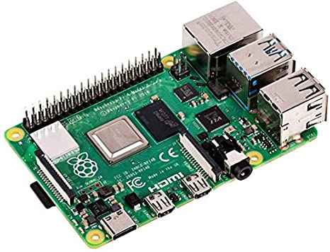

* 2-. Un modulo adaptador serie usb a serial, yo recomiendo el: **convertidor USB Serial FTDI TTL FT232R**

<!--style="margin-left:auto;margin-right:auto;width:100%;"-->

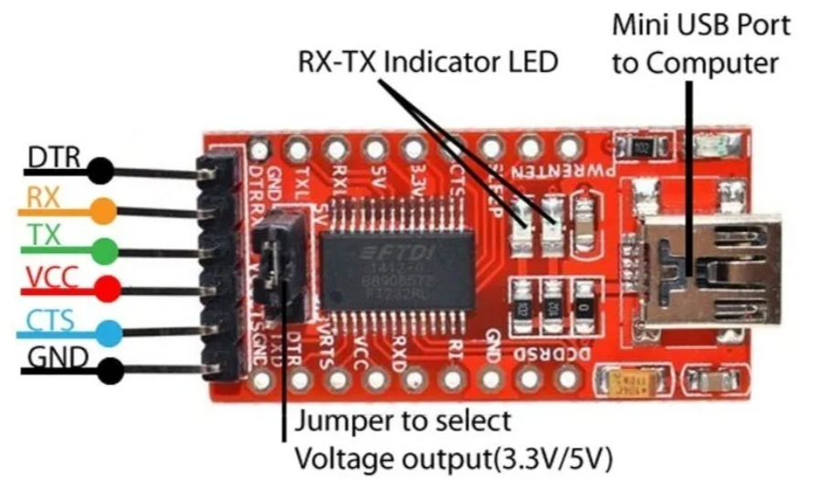

* 3-. Un modulo bluetooth hc-05

<!--style="margin-left:auto;margin-right:auto;width:100%;"-->

* 4-. Un cable USB a mini USB( para conectar el adaptador convertidor USB Serial FTDI TTL FT232R a un puerto usb de la rasberry o un puerto usb de la  computadora)
<!--style="margin-left:auto;margin-right:auto;width:100%;"-->

* 5-. Un led RGB de preferencia el **sensor led RGB módulo KY-016**

<!--style="margin-left:auto;margin-right:auto;width:100%;"-->

* 6-. Un sensor de temperatura módulo KY-013

<!--style="margin-left:auto;margin-right:auto;width:100%;"-->

* 7-. Un sensor de flama módulo KY-026 

<!--style="margin-left:auto;margin-right:auto;width:100%;"-->

* 8-. Un sensor de sonido módulo KY-037 

<!--style="margin-left:auto;margin-right:auto;width:100%;"-->

* 9-. Un módulo relevador 5V KY-019

<!--style="margin-left:auto;margin-right:auto;width:100%;"-->

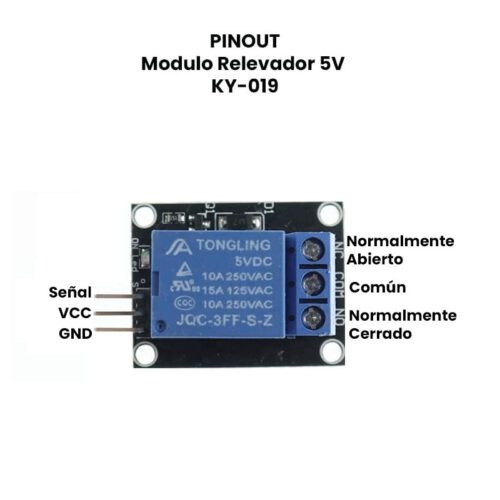

* 10-. Un arduino nano con su cable

<!--style="margin-left:auto;margin-right:auto;width:100%;"-->

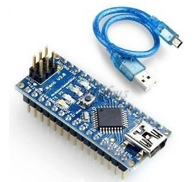

 

* 11-. Un esp-32 nodemcu Micro Usb

<!--style="margin-left:auto;margin-right:auto;width:100%;"-->

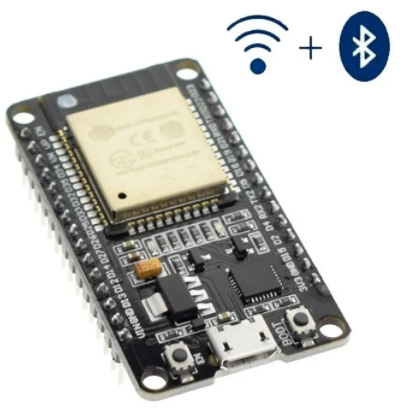
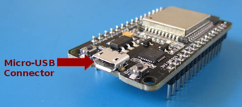

* 12-. Un cargador de celular con 5 volts de salida y minimo 1 A de corriente cuyo cable tambien permita la transmisión de datos  (para alimentar al esp32 y cargar los programas)

<!--style="margin-left:auto;margin-right:auto;width:100%;"-->

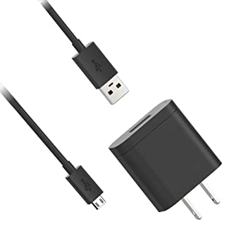

* 13-. Alambre de diferentes colores calibre 22(para conexiones en la protoboard) o jumpers macho, pero preferiblemente alambres

<!--style="margin-left:auto;margin-right:auto;width:100%;"-->

* 14-. Dos protoboards

<!--style="margin-left:auto;margin-right:auto;width:100%;"-->

### **1.2) Instalacion de paquetes de python**

[Regresar al menu principal](#menu)

Sofware que debera tener instalado la rasberry pi o la computadora:

  * Python 3 instalado 
  * La herramienta de gestión de paquetes pip3
  * Una vez cumplidos las dos anteriores instalaciones, entonces deberan instalarse los paquetes de python que vienen en el requirements.

    A continuación se muestra como poder instalar los paquetes de python que vienen en el requirements:

    * Sistema operativo Rasbian(el que por default viene instalado en la rasberry pi)

      * Instalando herramientas de pyqt5 para poder ejecutar mi programa y tambien para que el codigo fuente de este pueda ser facilmente  modificado:
            <pre>
              <code>
                sudo apt update
                sudo apt install python3-pyqt5
                sudo apt install pyqt5-dev-tools
                sudo apt-get install qtcreator
              </code>
            </pre>

      * Instalando  pyserial
            <pre>
              <code>
                pip3 install pyserial
              </code>
            </pre>

      * Instalando  pygame
            <pre>
              <code>
                pip3 install pygame
              </code>
            </pre>

      * Instalando  mutagen
            <pre>
              <code>
                pip3 install mutagen
              </code>
            </pre>

    * Sistema operativo windows

      * Instalando herramientas de pyqt5 para poder ejecutar mi programa y tambien para que el codigo fuente de este pueda ser facilmente  modificado:
            <pre>
              <code>
                pip3 install PyQt5
                pip3 install PyQt5-tools
              </code>
            </pre>

      * Instalando  pyserial
            <pre>
              <code>
                pip3 install pyserial
              </code>
            </pre>

      * Instalando  pygame
            <pre>
              <code>
                pip3 install pygame
              </code>
            </pre>

      * Instalando  mutagen
            <pre>
              <code>
                pip3 install mutagen
              </code>
            </pre>

 

## **2) Funcionamiento** 

### **2.1) Explicacion breve** 

[Regresar al menu principal](#menu)

Mi proyecto consiste en un pequeño sistema de domótica el cual es administrado por una interfaz gráfica de escritorio la cual es capaz de hacer lo siguiente: 

*  Controlar el prendido y el apagado de un foco RGB, asi como el color al que este prende entre una variedad de 7 posibles colores (blanco, verde,amarillo, rojo, magenta, azul, cian)
*  Controlar el prendido y el apagado de un ventilador 
*  Avisar al usuario cuando se detecte un  incendio
*  Permitir la programación de alarmas.
*  Ofrecer un sistema de administración de deberes.

### **2.2) Explicacion del sofware del proyecto** 

[Regresar al menu principal](#menu)

A continuación, se adjuntará una imagen de mi sistema de domótica y una breve explicación de cada apartado de ella:

<!--style="margin-left:auto;margin-right:auto;width:100%;"-->

Explicado lo anterior ahora proseguiré a explicar de una forma más detallada cada función del sistema de domótica:

### **2.2.1) Sistema de deberes**

[Regresar al menu principal](#menu)

La GUI permite  agregar deberes con la finalidad de que cada que vez que se termine un deber agregado, se  pueda eliminar de la lista de deberes, y sentir esa satisfacción personal de eliminar los deberes cada vez que se van cumpliendo.

### **2.2.1.1) Crear un deber**

[Regresar al menu principal](#menu)

* Dar clic izquierdo sobre el botón redondo de color verde con una cruz blanca dentro el cual se encuentra debajo de la esquina inferior derecha del rectangulo blanco que se encuentra debajo de la leyenda 'DEBERES'
* Posteriormente se aparecera una rectangulo blanco, ahi debera escribirse el deber.
* Si se desea crear otro deber se deberan repetir los pasos antes mencionados.

En el siguiente ejemplo se crearan 3 deberes:
  * correr en la mañana
  * hacer tarea
  * estudiar en la noche

<!---->

### **2.2.1.2) Cambiar el tamano y la posicion del texto de los deberes**

[Regresar al menu principal](#menu)

* Si se desea cambiar el tamaño de la letra de los deberes se deberá modificar el valor numérico del rectángulo que se encuentra a lado izquierdo del boton que sirve para agregar deberes:

<!---->

* Si se desea cambiar la posición del texto de los deberes, se deberá dar clic sobre el icono respectivo de alineación:

<!---->

### **2.2.1.3) Eliminar deberes cumplidos**

[Regresar al menu principal](#menu)

* Para eliminar un deber  ya sea por que se cumplio o por que hubo una equivocacion al crearlo se debera hacer lo siguiente:
  * Dar clic izquierdo sobre el cuadrado que se encuentra al lado izquierdo del deber que se desea eliminar
  * Al hacer el paso anterior  se  desplegara un cuadro de dialogo, el cual preguntara si efectivamente se desea eliminar el deber, se debera dar clic izquierdo sobre la opccion 'si'.

En el siguiente ejemplo se eliminaran 2 deberes:
  * correr en la mañana
  * hacer tarea

<!---->

 

### **2.2.2) Sistema de administracion de alarmas**

[Regresar al menu principal](#menu)

El sistema de alarmas permite  agendar  alarmas tal y como lo hace un teléfono celular, es decir permitirá:

•	Asignar un nombre a la alarma

•	Escoger la canción que tocará la alarma al ejecutarse, entre una lista de canciones que ofrecerá el programa de forma default o canciones que el usuario puede importar desde su administrador de archivos.

•	Escoger la hora y el día o los días en las cuales la alarma debe sonar.

•	Crear como máximo un numero de 50 alarmas.

•	Editar alarmas que ya fueron creadas.

•	Eliminar alarmas que ya fueron creadas.

•	Desactivar o activar una o varias alarmas.

A continuacion se proseguira a explicar de forma mas detallada 

### **2.2.2.1) Crear una alarma**

[Regresar al menu principal](#menu)

* Dar clic izquierdo sobre el botón redondo de color verde con una cruz blanca dentro, el boton se encuentra debajo de la esquina inferior derecha del rectangulo blanco que se encuentra debajo de la leyenda 'ALARMAS'

* Posteriormente se aparecera una ventana en la se deben ingresar los datos de la alarma que se desea crear

* Antes de dar un ejemplo de como crear una alarma primero  proseguire a explicar cada apartado de la ventana que se abrio al hacer el paso anterior.

* Una vez explicada la ventana anterior, proseguire a dar un ejemplo de como crear una alarma con las siguientes caracteristicas:

  * Nombre de la alarma: 'horaEscuela' 

  * Dia en los cuales sonar: lunes,martes,miércoles,jueves y viernes
  
  * Hora a la que sonara: 4:45 am  
  
  * Asunto: Despertar 
  
  * Cancion: Sera una de las que traer por default el programa

Una vez hecho lo anterior se podrá observar que apareceran los datos de la alarma creada dentro del   rectangulo blanco que se encuentra debajo de la leyenda 'ALARMAS', y eso ocurre por que todas las alarmas que se creen se mostraran ahi para que puedan ser facilmente editadas visualizadas o eliminadas.
 

A continuacion se crearan 2 alarmas mas para que se pueda apreciar de mejor manera lo anterior mencionado:

Es importante resaltar que los datos claves que se muestran de cada alarma creada, son los siguientes:

### **2.2.2.2) Editar una alarma**

[Regresar al menu principal](#menu)

Si se deseara editar una alarma, se debe dar clic izquierdo sobre el icono del lápiz que se encuentra en la esquina superior derecha de la alarma que se desea editar.

En el siguiente ejemplo se desea editar la alarma cuyo nombre es: **'irCorrer'** la cual suena los dias: **'sabado y domingo'** a las: **'6:45 am'**, los nuevos cambios que se desean hacer son los siguientes:
  * Que ahora suene a las: **'7:00 am'** los dias: **'sabado,domingo y lunes'** 

### **2.2.2.3) Eliminar una alarma**

[Regresar al menu principal](#menu)

Si se desea eliminar una alarma, se deberá dar clic izquierdo sobre el icono del tache que se encuentra en la esquina superior derecha de la alarma que se desea eliminar.

En el siguiente ejemplo se desea  eliminar la alarma  **‘horaEscuela’**:

### **2.2.2.4) Desactivar y activar una alarma**

[Regresar al menu principal](#menu)

Si se deseara desactivar una alarma para que no suene, se deberá deslizar la barra deslizadora que se encuentra en su esquina superior derecha.

En la siguiente imagen se activa y desactiva la alarma cuyo nombre es: **'irCorrer'**

### **2.2.2.5) Hora de sonar de la alarma**

[Regresar al menu principal](#menu)

¿Que pasa cuando es la hora de sonar de una alarma?

Se mostrará un cuadro emergente con únicamente dos datos de la alarma que está sonando: la hora a la que debe sonar y el nombre de la alarma

En el siguiente ejemplo se puede apreciar la alarma **'irDormir'**: se activo y para apagarla debera deslizarse la barra hasta el extremo derecho, tal y como se hace en un celular, cuando pasa eso, la ventana se cierra automaticamente.

### **2.2.2.6) Establecer una cancion de tu elecccion en una alarma**

[Regresar al menu principal](#menu)

¿Como establecer como canción de alarma una canción de mi eleccion?

El programa permite importar canciones en  la ventana que se abre cuando se esta creando una alarma o editando un alarma.Una vez abierta dicha ventana, para importar una cancion se deberan seguir los siguientes pasos:

* Primero deberá escogerse la lista de reproducción ‘Mis pistas’ dando clic izquierdo sobre el botón respectivo.

* Si no se ha agregado ninguna canción se vera una  lista de reproducción vacía pero en caso contrario 
se veran los nombres de las canciones ya importadas.

* Para agregar una canción se deberá dar clic sobre el botón de forma de carpeta, el cual al hacer clic sobre el, la GUI abrira el explorador de archivos el cual permite elegir la canción que se desea agregar desde la ubicación en donde se encuentre.

* Una vez escogida la canción se aparecera en la lista de reproducción lista para ser seleccionada.

### **2.2.3) Sistema de control**

[Regresar al menu principal](#menu)

### **2.2.3.1) Ver el dia la hora y la temperatura**

[Regresar al menu principal](#menu)

El sistema muestra  al usuario:

•	La fecha en la cual se encuentra (nombre del día, numero de día, nombre del mes y año)

•	La hora en la cual se encuentra (hora, minuto, AM/PM)

•	La temperatura actual a la que se encuentra. Es importante mencionar que la temperatura que muestra el programa  se actualiza  cada vez que el sistema detecta una variación de temperatura de +- 0.3 [°C]

### **2.2.3.2) Prendido manual y automatico de los objetos led RGB y ventilador**

[Regresar al menu principal](#menu)

El programa ofrece dos modalidades para controlar el prendido y apagado de los objetos(ventilador y led RGB) las cuales son las siguientes:

  * Control automatico
  * Control manual 

### **2.2.3.2.1) Funcionamiento del control manual y control automatico**

[Regresar al menu principal](#menu)

**¿Cómo funciona exactamente el control manual y el control automatico?**  

<table>
    <thead>
        <tr>
          <th >Dispositivo</th>
          <th colspan=2>Tipo de encendido y apagado</th>
        </tr>
        <tr >
            <th>  </th>
            <th > Automatico </th>
            <th> Manual</th>
        </tr>
    </thead>
    <tbody>
        <tr>
            <td> LED RGB </td>
            <td >Si se detecta un aplauso o un sonido similar, se prendera el LED RGB si se encontraba apagado, o se apagará si se encontraba prendido.</td>
            <td rowspan=2> Atreves de una barra deslizante que se encontrará inmersa en la GUI, el usuario podrá apagar o prender el objeto (led RGB o ventilador):
            <ol>
              <li>Si desliza la barra a la izquierda se apagará al objeto.</li>
              <li>Si desliza la barra a la derecha se prendera al objeto.</li>
            </ol>
</td>
       </tr>
        <tr>
             <td> VENTILADOR </td>
             <td>
            Si se detecta una temperatura mayor o igual a la que el usuario estableció se prendera el ventilador, en caso contrario se apagará. 
Mas adelante se explicará cómo se puede modificar  la temperatura a la cual prende el ventilador
            </td>
        </tr>
    </tbody>
</table>

### **2.2.3.2.2) Restricciones del control manual y control automatico**

[Regresar al menu principal](#menu)

Es importante mencionar que los controles: automatico y manual no pueden funcionar al mismo tiempo, es decir: 

•	Si se elige controlar el prendido y apagado de los objetos de forma automática no se podrán controlar de forma manual, por el contrario, si se elige controlar el prendido y apagado de forma manual no se podrán controlar de forma automática por ende:
* Cuando se elige la modalidad manual, la GUI desbloquea a las barras deslizadoras que se encuentran abajo de la imagen del foco y ventilador, para que el usuario pueda manipularlas con el fin de prender o apagar el objeto que quiera.
* Cuando se elige la modalidad automatica la GUI, bloquea a las barras deslizadoras para que el usuario no pueda manipularlas, ya que los objetos solo podrán ser prendidos de forma automática. 

### **2.2.3.2.3) Prender y apagar manualmente el led RGB**

[Regresar al menu principal](#menu)

**Instrucciones del prendido y apagado manual del led RGB**

*  Asegurarnos que se este en modalidad manual
*  Mover la barra deslizadora que se encuentra debajo de la imagen del foco, a la izquierda si se desea apagar el led RGB.
*  Mover la barra deslizadora que se encuentra debajo de la imagen del foco, a la derecha si se desea prender el led RGB.

### **2.2.3.2.4) Prender y apagar manualmente el ventilador**

[Regresar al menu principal](#menu)

**Instruccioes del prendido manual del ventilador**

*  Asegurarnos que se este en modalidad manual
*  Mover la barra deslizadora que se encuentra debajo de la imagen del ventilador, a la izquierda si se desea apagar el ventilador.
*  Mover la barra deslizadora que se encuentra debajo de la imagen del ventilador, a la derecha si se desea prender el ventilador.

### **2.2.3.2.5) Prender y apagar automaticamente el led RGB**

[Regresar al menu principal](#menu)

**Instrucciones del prendido y apagado automatico del led RGB**

*  Asegurarnos que se este en modalidad automatica.
*  Si el led RGB se encuentra apagado y se desea prender, se de debera aplaudir una sola vez, para que se prenda.
*  Si el led RGB se encuentra prendido y se desea apagar, se debera aplaudir una sola vez, para que se apague.

### **2.2.3.2.6) Prender y apagar automaticamente el ventilador**

[Regresar al menu principal](#menu)

**Instruccioes del prendido automatico del ventilador**
*  Asegurarnos que se este en modalidad automatica.
*  Cersiorarse que la temperatura  a la cual se desea prender el ventilador sea la correcta, para este ejemplo se desea que se prenda el ventilador a partir de los 28 [°C].
*  Esperar a que la temperatura del dia sea mayor o igual a la temperatura establecida para que el programa mande a prender el ventilador de forma automatica.En el siguiente ejemplo se tocara al sensor de temperatura para que la temperatura que el registre aumente y asi se llegue o supere a la temperatura establecida y por ende se prenda el ventilador, despues se proseguira a dejar de tocar el sensor de temperatura y se podra apreciar como baja la temperatura registrada por el sensor y cuando esta sea menor a la establecida se podra visualizar como se manda a apagar el ventilador.

### **2.2.3.3) Cambiar el color del led RGB**

[Regresar al menu principal](#menu)

El programa permite al usuario  cambiar el color con el que prende el led RGB entre una variedad de 7 posibles colores (blanco, verde, amarillo, rojo, magenta, azul, cian) siguiendo las siguientes instrucciones:

*  Dar clic izquierdo sobre el botón que se encuentra en la esquina superior derecha de la imagen del foco.
*  Dar clic izquierdo sobre el color de preferencia.
*  Posteriormente dar clic izquierdo sobre el texto con la leyenda de: 'Aplicar'

Es importante mencionar que:

•	Si se cambia el color del led RGB mientras este se encuentra apagado, no se visualizara el cambio de color hasta que el led RGB se prenda, es decir si se efectuará el cambio de color del led RGB pero como se encuentra apagado, no se podrá apreciar dicho cambio hasta que se prenda.

•	Si se cambia el color del led RGB mientras este esté prendido, se apreciara el cambio de color casi de una manera instantánea. 

### **2.2.3.4) Detector de incendios**

[Regresar al menu principal](#menu)

El sistema de domótica siempre  esta  al pendiente de la aparición de fuego, y si detecta alguna flama esta le alertara al usuario a través de la GUI por medio de un sonido y un mensaje emergente.

Es importante mencionar que cuando se detecta fuego:
* Se bloquea el control automático y manual de los objetos
* No se podrá hacer nada en la GUI
* Si una alarma tiene que sonar no sonara ya que la prioridad es alertar al usuario de la presencia del fuego.

A continuación, se adjuntará un video de como reacciona el sistema ante la deteccion de fuego.

### **2.2.4) Datos del programador**

[Regresar al menu principal](#menu)

El sistema de domótica ofrece un apartado en donde el usuario pueda ver los contactos del programador, es decir mis datos de contacto personales, tambien muestra un link de acceso al  repositorio de todo este proyecto, lo único que se tendrá que hacer es dar clic izquierdo sobre el icono con signo de exclamación e inmediatamente se desplegara una ventana con dichos datos.

A continuación de muestra como.

<!--style="margin-left:auto;margin-right:auto;width:100%;"-->

### **2.3) Circuitos del proyecto**

[Regresar al menu principal](#menu)

Mi proyecto basicamente se divide en dos circuitos:

* El primer circuito se encarga de las siguientes cosas:
  * Avisarle a la rasberry pi cuando se detecte una flama de fuego
  * Avisarle a la rasberry pi cuando se detecte un ruido similar al de un aplauso
  * Adjuntarle a la rasberry pi la temperatura que se esta sensando
  * Avisarle al circuito 2 por medio de comunicación bluetooth cuando prender u apagar el ventilador
  * Avisarle al circuito 2 por medio de comunicación bluetooth cuando prender u apagar el led RGB
  * Avisarle al circuito 2 por medio de comunicación bluetooth con que color debe prender el led RGB

[Dar clic aqui para ver circuito de manera mas legible el circuito 1](HADWARE/circuitos/circuito_1.png)

<!--style="margin-left:auto;margin-right:auto;width:100%;"-->

* El segundo circuito se encarga de las siguientes cosas:
  * Prender u apagar el ventilador cuando el circuito 1 se lo indique
  * Prender u apagar  el led RGB cuando el circuito 1 se lo indique
  * Prender el color RGB al color indicado por el circuito 1

[Dar clic aqui para ver circuito de manera mas legible el circuito 2](HADWARE/circuitos/circuito_2.png)

<!--style="margin-left:auto;margin-right:auto;width:100%;"-->

## **3) Ensamble del proyecto**

[Regresar al menu principal](#menu)

### **3.1) Paso 1**

[Regresar al menu principal](#menu)

Cumplir con todos los prerrequisitos ya mencionados anteriormente, es decir **conseguir el material e intalar python y los paquetes de python necesarios ya sea en la rasberry pi o en la computadora**

  * [1) Ir al apartado de  prerrequisitos](#1-prerrequisitos)
      * [1.1) Ir al apartado de materiales](#11-materiales)
      * [1.2) Ir al apartado de los paquetes que se deben instalar en python](#12-instalacion-de-paquetes-de-python)

### **3.2) Paso 2**

[Regresar al menu principal](#menu)

Descargar el codigo fuente de la interfaz grafica que desarrolle  en la rasberry pi o en la computadora, el codigo fuente se encuentra en la direccion: **<< GUI/>>**

[Dar clic aqui para ver el codigo fuente de la interfaz grafica](GUI/)

Para comprobar el correcto funcionamiento del codigo fuente de mi interfaz grafica sin ser necesario las otras conexiones, ejecutar el script <<**mainFast.py**>> ya que dicho script hace funcionar mi interfaz grafica sin ser necesario que este conectado el **<<cirucito 1>>** a los puertos usb de la rasberry pi o la computadora.

Si estas en la rasberry pi, para ejecutar el script no olvidar conceder permisos de ejecución al script, es decir:

<pre>
  <code>
    chmod +x mainFast.py
  </code>
</pre>

Y si quieres concederle todos los permisos, podras hacerlo con:

<pre>
  <code>
    chmod 777 mainFast.py
  </code>
</pre>

Finalmente para ejecutar el script si estas desde la rasberry pi podras hacerlo con:

<pre>
  <code>
    ./mainFast.py
  </code>
</pre>

ya que el archivo el archivo **<<mainFast.py>>** ya incluye en su primer linea: **<<#! /usr/bin/env python3>>**

Tambien podras ejecutar el script con: 

<pre>
  <code>
    python3 mainFast.py
  </code>
</pre>

Una vez ejecutado el script se mostrara mi interfaz grafica, con la cual deberas interactuar para comprobar su correcto funcionamiento, lo que podras hacer sera crear notas u alarmas para serciorar que todo este funcionando correctamente.

### **3.3) Paso 3**

[Regresar al menu principal](#menu)

Armar el **<<cirucito 2>>**:
[dar clic aqui para ver circuito de manera mas legible el circuito 2](HADWARE/circuitos/circuito_2.png)

Para comprobar  el correcto funcionamiento del **<<cirucito 2>>**  deberas hacer lo siguiente:

* Cargar el script que se encuentra en: <<**HADWARE/script_esp32_test**>>  en el esp32

  [dar clic aqui para ver el script_esp32_test](HADWARE/script_esp32_test)

* Dejar conectado el esp-32 a la computadora

* Descargar la aplicación movil cuyo nombre es: **<< Serial Bluetooth Terminal >>**

  <!--style="margin-left:auto;margin-right:auto;width:100%;"-->
  

  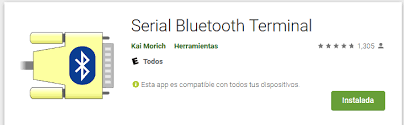
  

* Activar el Bluetooth  en tu dispositivo movil
* Vincularte a traves de Bluetooth con el esp-32, el cual aparece con el nombre de: **<<Cuarto_luzFlamaVentilador>>**

  <!--style="margin-left:auto;margin-right:auto;width:100%;"-->
  

  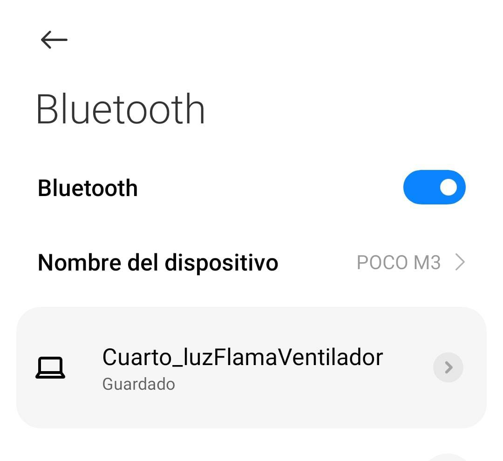
  

* Abrir la aplicación  **<< Serial Bluetooth Terminal >>** y conectarse con el esp-32, el cual aparece con el nombre de: **<<Cuarto_luzFlamaVentilador>>**, a continuación se muestran los pasos de como hacerlo:

  <!--style="margin-left:auto;margin-right:auto;width:100%;"-->
  

  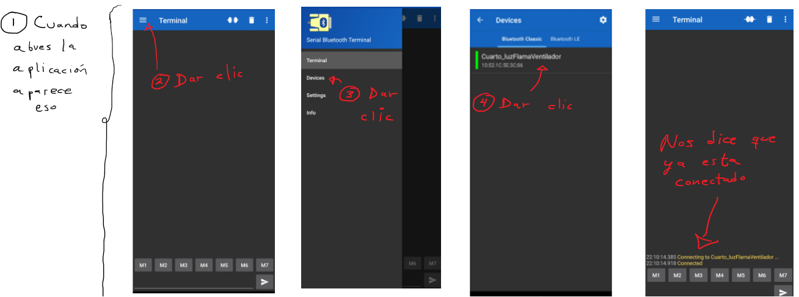
  

* Ahora enviar los siguientes mensajes al esp32 atraves de la aplicación **<< Serial Bluetooth Terminal >>** para comprobar el correcto funcionamiento del **<<cirucito 2>>**  : 

  * Si envias: << __10,1  >> deberas recibir un << 5 >> como respuesta del esp-32 y aparte debera prenderse el ventilador

  * Si envias: << __10,1  >> deberas recibir un << 5 >> como respuesta del esp-32 y aparte debera apagarse el ventilador

  * Si envias: << __11,1 __ >> deberas recibir un << 5 >> como respuesta del esp-32 y aparte debera prenderse el led RGB

  * Si envias: << __11,0 __ >> deberas recibir un << 5 >> como respuesta del esp-32 y aparte debera apagarse el led RGB

  * Si el led RGB esta prendido y envias: << __11,2,0 __ >> deberas recibir un << 5 >> como respuesta del esp-32 y aparte debera cambiar a color blanco el led RGB

  * Si el led RGB esta prendido y envias: << __11,2,1 __ >> deberas recibir un << 5 >> como respuesta del esp-32 y aparte debera cambiar a color rojo el led RGB
    
  * Si el led RGB esta prendido y envias: << __11,2,2 __ >> deberas recibir un << 5 >> como respuesta del esp-32 y aparte debera cambiar a color verde el led RGB

  * Si el led RGB esta prendido y envias: << __11,2,3 __ >> deberas recibir un << 5 >> como respuesta del esp-32 y aparte debera cambiar a color azul el led RGB

  * Si el led RGB esta prendido y envias: << __11,2,4 __ >> deberas recibir un << 5 >> como respuesta del esp-32 y aparte debera cambiar a color amarillo el led RGB

  * Si el led RGB esta prendido y envias: << __11,2,5 __ >> deberas recibir un << 5 >> como respuesta del esp-32 y aparte debera cambiar a color magenta el led RGB

  * Si el led RGB esta prendido y envias: << __11,2,6 __ >> deberas recibir un << 5 >> como respuesta del esp-32 y aparte debera cambiar a color cian el led RGB

Una vez comprobado el correcto funcionamiento del **<<cirucito 2>>**, ahora deberas cargar el script que se encuentra en: <<**HADWARE/script_esp32_luzFlamaVentilador**>> en el esp-32

[dar clic aqui para ver el script_arduinoNano_extensionRasberry](HADWARE/script_esp32_luzFlamaVentilador)

### **3.4) Paso 4**

[Regresar al menu principal](#menu)

Armar el <<**circuito 1**>>, pero aun no conectar los cables USB a los puertos USB de la rasberry pi o computadora 

[dar clic aqui para ver el circuito 1 de manera mas legible](HADWARE/circuitos/circuito_1.png)

Hecho lo anterior ahora deberan cargarse ciertas configuraciones al modulo bluetooth hc-05, para hacer dichas configuraciones, debera conectarse el  cable con salida USB del FTDI a un puerto USB de una computadora que tenga instalado el IDE de arduino, una vez hecho lo anterior se debera abrir el monitor serial del IDE del arduino en el puerto serial que  la computadora le asigno al FTDI, una vez hecho lo anterior recomiendo leer el siguiente manual para saber acerca de las configuraciones al modulo blueetooth hc-05:

[manual de los comandos AT del bluetooth hc-05 ](HADWARE/manuales/configuracionBluetooth_hc05.pdf)

Una vez leido y comprendido el manual, se debera hacer lo siguiente:

* Entrar al modo AT 2
* Con el comando <<**AT+PSWD**>> establecer al  modulo bluetooth hc-05  un codigo de vinculación igual a **<<1234>>** 
* Con el comando <<**AT+ROLE**>> configurar el role del modulo bluetooth hc-05 para que trabaje como <<**esclavo**>>.
* Con el comando <<**AT+NAME**>> establecerle un nombre al modulo bluetooth hc-05 el cual debera ser: <<**blutu_roni**>>

* Aplicar el siguiente comando  <<**AT+UART=9600,0,0**>> para establecer una velocidad y configuración  estandar de comunicación

* Una vez hecho lo anterior debera salirse del modo AT 2 con el comando: <<**AT+RESET**>>

Para comprobar que el modulo bluetooth hc-05 fue configurado existosamente se debera hacer lo siguiente: 
* Activar el bluetooth de tu celular 
* Vincularte con el dispositivo bluetooth cuyo nombre sea: <<**blutu_roni**>>, cuando te pida la contraseña de emparamiento ingresar la contraseña: <<**1234**>> y finalmente una vez emparejado el celular con el modulo bluetooth hc-05, ahora deberas abrir la aplicación que previamente has instalado, es decir la aplicación cuyo nombre es: **<< Serial Bluetooth Terminal >>** y atraves de ella mandarle mensajes al modulo bluetooth hc-05, los cuales deberian verse reflejados en el monitor serial del IDE del arduino, si nos lo vez probablemente sea por que no has cambiado la velocidad del monitor serial a la velocidad 9600 baudios.

Una vez hecho lo anterior seguira otra prueba del correcto funcionamiento del modulo bluetooth hc-05, sin embargo para hacer dicha prueba se debera desemparejar el modulo bluetooth hc-05 del celular, una vez hecho lo anterior se debera hacer lo siguiente:

*  Dejar conectado el cable  USB del FTDI al  puerto USB de la computadora que tiene instalado el IDE de arduino.En el IDE del arduino una vez mas abrir el monitor serial en el puerto que le asigno la computadora al FTDI y configurar la velocidad de comunicación a: 9600 baudios
* Conectar el esp-32 al  puerto USB de la computadora que tiene instalado el IDE de arduino.
* Esperar que el esp-32 se empareje con el  modulo bluetooth hc-05, recordar que esto sera cuando el modulo bluetooth hc-05 haga un doble parpadeo cada 2 segundos aproximadamente.

* En el el monitor serial en el puerto que le asigno la computadora al FTDI y configuraste la velocidad de comunicación a: 9600 baudios empezar a enviar los siguientes mensajes:

  * Si envias: << __10,1  >> deberas recibir un << 5 >> como respuesta del esp-32 y aparte debera prenderse el ventilador

  * Si envias: << __10,1  >> deberas recibir un << 5 >> como respuesta del esp-32 y aparte debera apagarse el ventilador

  * Si envias: << __11,1 __ >> deberas recibir un << 5 >> como respuesta del esp-32 y aparte debera prenderse el led RGB

  * Si envias: << __11,0 __ >> deberas recibir un << 5 >> como respuesta del esp-32 y aparte debera apagarse el led RGB

  * Si el led RGB esta prendido y envias: << __11,2,0 __ >> deberas recibir un << 5 >> como respuesta del esp-32 y aparte debera cambiar a color blanco el led RGB

  * Si el led RGB esta prendido y envias: << __11,2,1 __ >> deberas recibir un << 5 >> como respuesta del esp-32 y aparte debera cambiar a color rojo el led RGB
    
  * Si el led RGB esta prendido y envias: << __11,2,2 __ >> deberas recibir un << 5 >> como respuesta del esp-32 y aparte debera cambiar a color verde el led RGB

  * Si el led RGB esta prendido y envias: << __11,2,3 __ >> deberas recibir un << 5 >> como respuesta del esp-32 y aparte debera cambiar a color azul el led RGB

  * Si el led RGB esta prendido y envias: << __11,2,4 __ >> deberas recibir un << 5 >> como respuesta del esp-32 y aparte debera cambiar a color amarillo el led RGB

  * Si el led RGB esta prendido y envias: << __11,2,5 __ >> deberas recibir un << 5 >> como respuesta del esp-32 y aparte debera cambiar a color magenta el led RGB

  * Si el led RGB esta prendido y envias: << __11,2,6 __ >> deberas recibir un << 5 >> como respuesta del esp-32 y aparte debera cambiar a color cian el led RGB

Si se tiene exito con las pruebas realizadas anteriormente significara que:

* El esp-32 y modulo bluetooth hc-05 funcionan correctamente en conjunto.

Una vez hecho todo lo anterior, ya se podra desconectar el cable  USB del FTDI y tambien ya podra desconectar el esp32 de la computadora.

### **3.5) Paso 5**

[Regresar al menu principal](#menu)

Una vez armado el <<**circuito 1**>> en el paso anterior, ahora se pedira cargar el script que se encuentra en: <<**HADWARE/script_arduinoNano_extensionRasberry**>> en el arduino nano
[dar clic aqui para ver el script_arduinoNano_extensionRasberry](HADWARE/script_arduinoNano_extensionRasberry)

Ahora se pedira ya conectar los cables USB( cable del FTDI y cable del arduino nano) a  los puertos usb de la rasberry pi o computadora, hecho lo anterior ahora se pedira que se halle que puerto que  le asigno la rasberry pi o computadora a cada dispositivo(FTDI y arduino nano), si estas en la rasberry pi esto se podra hacer haciendo lo siguiente:

Primero habilitar la interfaz en serie del Raspberry Pi:

  <!--style="margin-left:auto;margin-right:auto;width:100%;"-->
  

  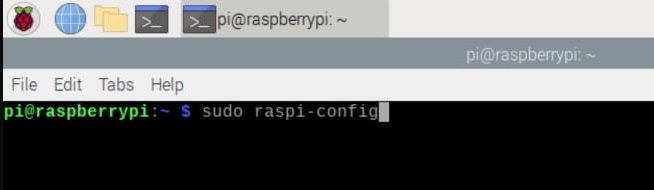
    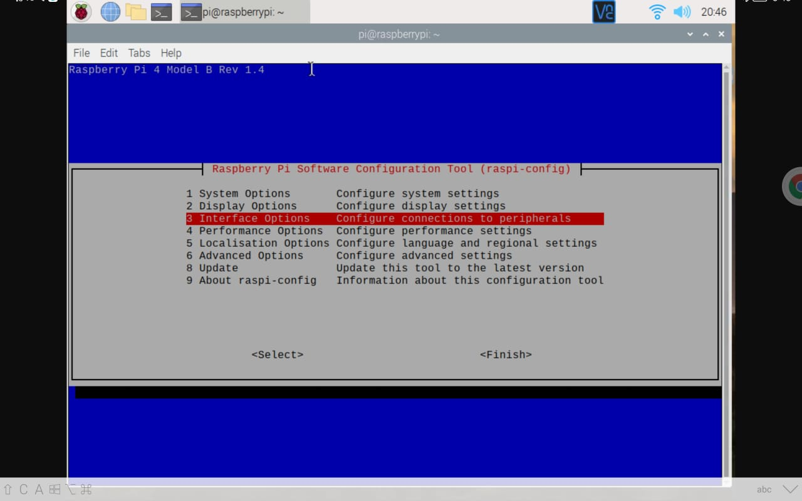
  

  <!--style="margin-left:auto;margin-right:auto;width:100%;"-->
  

  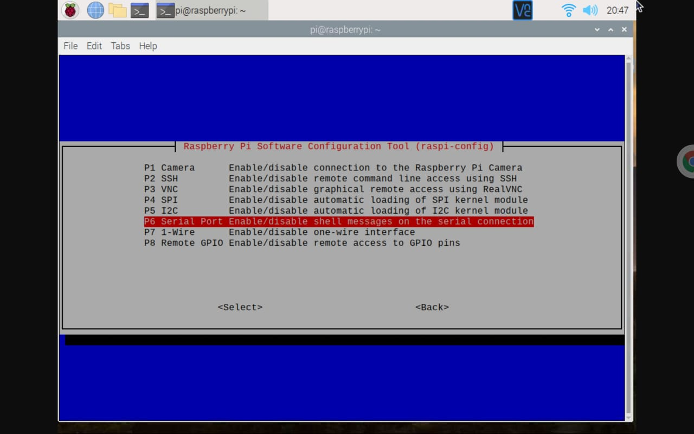
  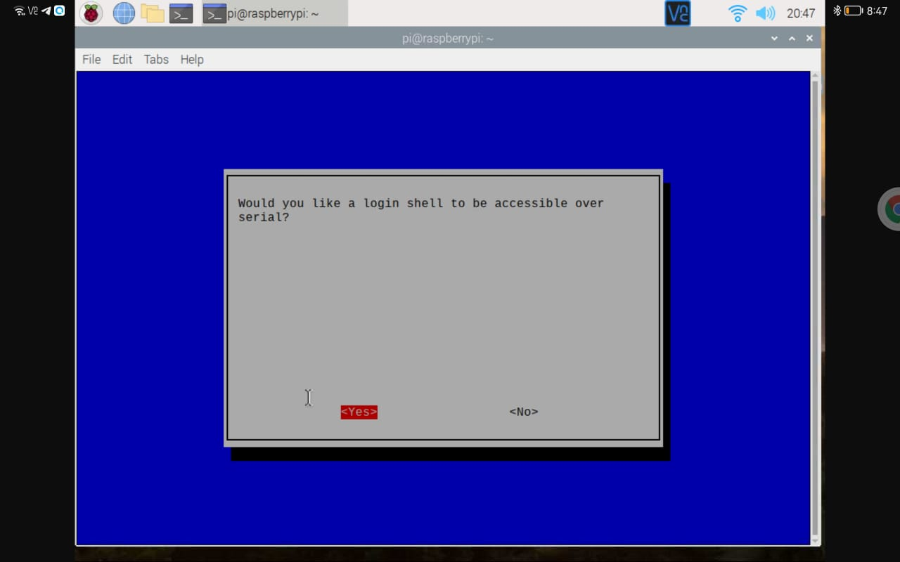
  

  <!--style="margin-left:auto;margin-right:auto;width:100%;"-->
  

  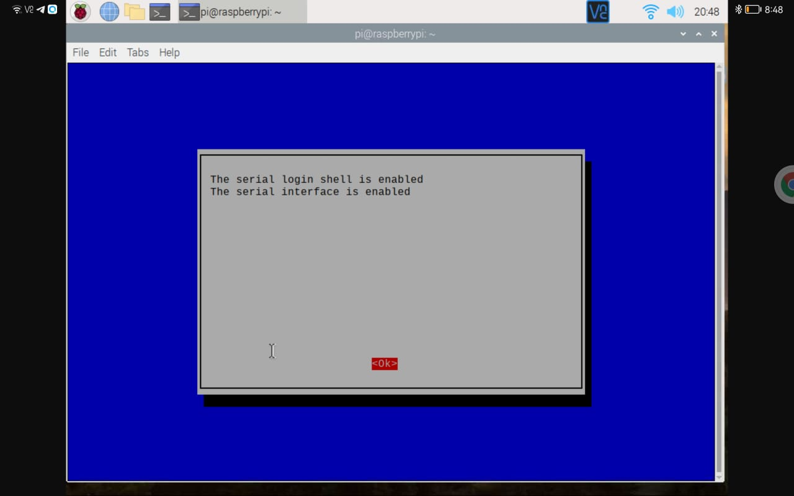
  

Segundo: Desconectar los cables USB( cable del FTDI y cable del arduino nano) de  los puertos usb de la rasberry pi y digitar el comando el cual servira para ver las direcciones seriales sin los dos dispositivos conectados.

<pre>
  <code>
    ls /dev/tty*
  </code>
</pre>

Una vez hecho lo anterior ahora conectar el cable USB del arduino nano y volver a digitar el comando anterior para volver a ver las direcciones seriales, sin embargo en esta ocación se vera una mas, la cual correspondera a la direccion serial que le fue asignada al arduino nano.

Una vez hecho lo anterior ahora se debera conectar el cable USB del FTDI y volver a digitar el comando anterior para volver a ver las direcciones seriales, sin embargo en esta ocación se vera otra direccion mas, la cual correspondera al direccion serial que le fue asignada al  del FTDI.

  <!--style="margin-left:auto;margin-right:auto;width:100%;"-->
  

  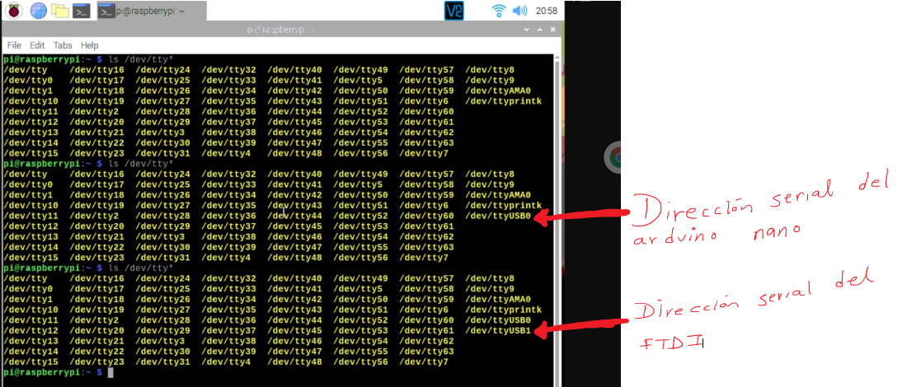
  

Ya sabiendo que direcciones seriales se le asignaron al FTDI y al arduino nano ahora se debera ir al codigo fuente de la interfaz grafica, el cual fue descargado en el PASO 1, y se debera abrir el scipt cuyo nombre es <<**recursos.py**>> para indicarle cuales son los puertos que le asigno la rasberry pi al arduino nano y al FTDI.

 <!--style="margin-left:auto;margin-right:auto;width:100%;"-->
  

  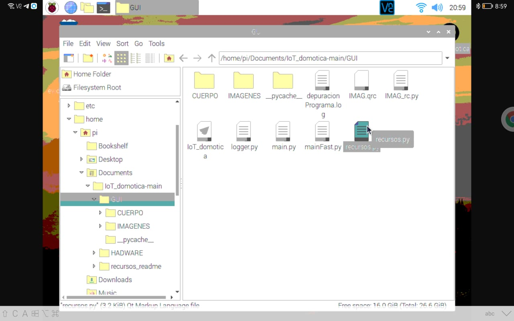
    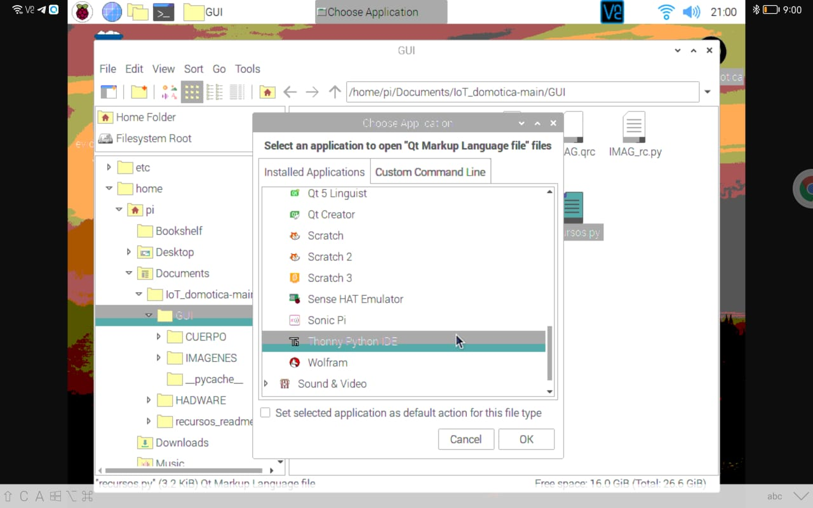
  

 <!--style="margin-left:auto;margin-right:auto;width:100%;"-->
  

  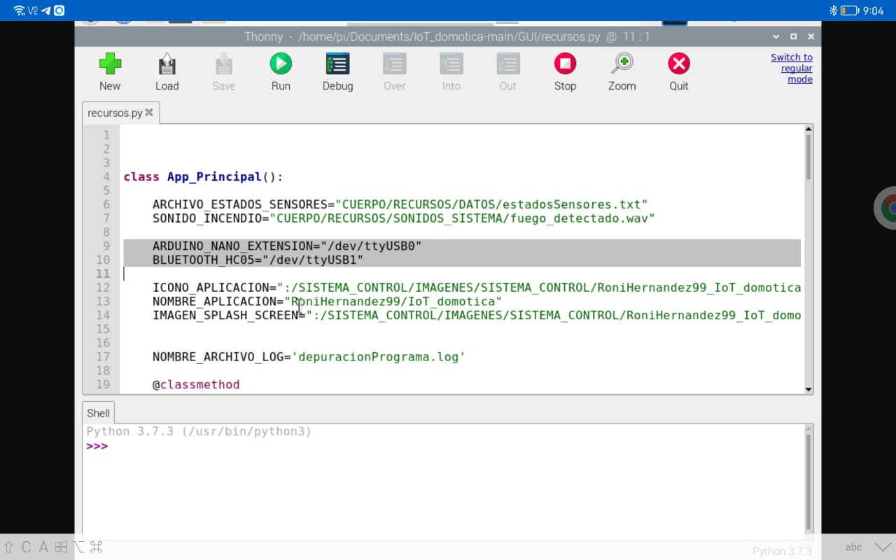
  

Y por fin ya podra ser ejecutado el script <<**main.py**>> para que todo el proyecto pueda funcionar, sin embargo no hay que olvidar que....

Si estas en la rasberry pi, para ejecutar el script conceder permisos de ejecución al script, es decir:

<pre>
  <code>
    chmod +x main.py
  </code>
</pre>

Y si quieres concederle todos los permisos, podras hacerlo con:

<pre>
  <code>
    chmod 777 main.py
  </code>
</pre>

Finalmente para ejecutar el script si estas desde la rasberry pi podras hacerlo con:

<pre>
  <code>
    ./main.py
  </code>
</pre>

ya que el archivo el archivo **<<main.py>>** ya incluye en su primer linea: **<<#! /usr/bin/env python3>>**

Tambien podras ejecutar el script con: 

<pre>
  <code>
    python3 main.py
  </code>
</pre>

### **3.6) Paso 6(opccional)**

[Regresar al menu principal](#menu)

Si estas en la rasberry pi y deseas hacer un archivo **<<.desktop>>** para ejecutar el programa con solo un clic, podras hacerlo haciendo lo siguiente:

* En el codigo fuente que descargaste de la interfaz grafica hay un archivo ubicado en la carpeta <<**GUI/**>> cuyo nombre es <<**desktop.desktop**>>, dicho archivo deberas copiarlo en el lugar donde quieras, para que al dar un clic sobre dicho archivo se ejecute el programa.

* Una vez copiado dicho archivo en el lugar que quieras, ahora deberas abrirlo y modificarlo.Al abrirlo veras algo similar a lo siguiente:

 <!--style="margin-left:auto;margin-right:auto;width:100%;"-->
  

  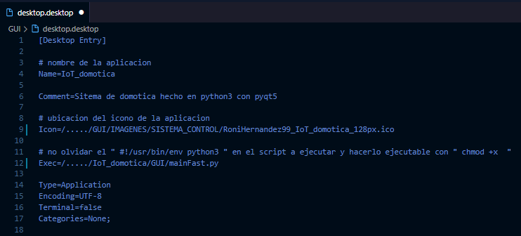
  

Lo que deberas hacer es modificar las siguientes lineas de dicho archivo:

<pre>
  <code>
  Icon=/...../GUI/IMAGENES/SISTEMA_CONTROL/RoniHernandez99_IoT_domotica_128px.ico
  Exec=/...../IoT_domotica/GUI/mainFast.py
  </code>
</pre>

Deberas remaplazar los puntos suspensivos de las dos lineas, por la dirección absoluta en la que se encuentra la carpeta <<**GUI/**>> que es la que almacena el codigo fuente de la interfaz grafica.

Ejemplo: Supogamos que la carpeta  <<**GUI/**>> que es la que almacena el codigo fuente de la interfaz grafica, se encuentra almacenada en mi rasberry pi en la dirección: <<**home/pi/Desktop/proyectos/IoT_domotica**>>, entonces en la dos lineas anteriores debere ramplzar los puntos suspensivo por dicha direccion es decir debera hacer lo siguiente:

<pre>
  <code>
  Icon=/home/pi/Desktop/proyectos/IoT_domotica/GUI/IMAGENES/SISTEMA_CONTROL/RoniHernandez99_IoT_domotica_128px.ico
  Exec=/home/pi/Desktop/proyectos/IoT_domotica/IoT_domotica/GUI/main.py
  </code>
</pre>

Una vez hecho lo anterior se le deberan dar permisos a este archivo que modificaste, es decir al archivo <<**desktop.desktop**>>

<pre>
  <code>
    chmod 777 desktop.desktop
  </code>
</pre>

Y con eso todo al dar clic sobre dicho archivo deberia abrir el programa.

 <!--style="margin-left:auto;margin-right:auto;width:100%;"-->
  

  
  

### **4) Posibles errores**

[Regresar al menu principal](#menu)

## Driver del arduino nano:

* ¿El ID de Arduino no reconoce al arduino nano? 

  * Solucion: Instalar los drivers respectivos del arduino nano:

  * En el siguiente video explican como instalar los drivers respectivos y donde encontrarlos: https://www.youtube.com/watch?v=1-ZyM0dGCY8

  * En el siguiente link estan los drivers del arduino nano: http://www.wch-ic.com/downloads/CH341SER_EXE.html 

* ¿Problemas con el audio con la rasberry pi 4B con el sistema operativo Rasbian?

  * Asegurate de que estes conectado el HDM0 de las rasberri
  * Asegurate de que al dar clic derecho sobre el icono de bocina que se encuentra en la parte superior de la pantalla este seleccionada la opccion: HDMI y NO la opcción AV Jack

### **5) Fuentes de informacion:**

[Regresar al menu principal](#menu)

* El pdf que adjunte en el apartado <<**HADWARE/manuales/desktopLinux.pdf**>> fue un pdf que se obtuve de la siguiente pagina de internet: https://www.hackster.io/kamal-khan/desktop-shortcut-for-python-script-on-raspberry-pi-fd1c63 la razon por la cual la converti a pdf, es para tener un respaldo de esa valiosa información.

  [dar clic aqui para ver el pdf](HADWARE/manuales/desktopLinux.pdf)

* El pdf que adjunte en el apartado <<**HADWARE/manuales/alimentacionEsp32.pdf**>> fue un pdf que se obtuve de la siguiente pagina de internet: https://emariete.com/alimentar-desde-nodemcu-wemos-mini-d1-y-arduino/ la razon por la cual la converti a pdf, es para tener un respaldo de esa valiosa información.

  [dar clic aqui para ver el pdf](HADWARE/manuales/alimentacionEsp32.pdf)

* El pdf que adjunte en el apartado <<**HADWARE/manuales/configuracionBluetooth_hc05.pdf**>> fue un pdf que se obtuve de la siguiente pagina de internet: https://naylampmechatronics.com/blog/24_configuracion-del-modulo-bluetooth-hc-05-usando-comandos-at.html la razon por la cual la converti a pdf, es para tener un respaldo de esa valiosa información.

  [dar clic aqui para ver el pdf](HADWARE/manuales/configuracionBluetooth_hc05.pdf)

* El pdf que adjunte en el apartado <<**HADWARE/manuales/comunicacionSerialArduinoRasberryPi.pdf**>> fue un pdf que se obtuve de la siguiente pagina de internet: https://www.aranacorp.com/es/comunicacion-en-serie-entre-raspberry-pi-y-arduino/   
la razon por la cual la converti a pdf, es para tener un respaldo de esa valiosa información.

  [dar clic aqui para ver el pdf](HADWARE/manuales/comunicacionSerialArduinoRasberryPi.pdf)

* El pdf que adjunte en el apartado <<**HADWARE/manuales/comunicacionSerialArduinoRasberryPi_2.pdf**>> fue un pdf que se obtuve de la siguiente pagina de internet: https://diyi0t.com/arduino-to-raspberry-pi-serial-communication/  
la razon por la cual la converti a pdf, es para tener un respaldo de esa valiosa información.

  [dar clic aqui para ver el pdf](HADWARE/manuales/comunicacionSerialArduinoRasberryPi_2.pdf)

